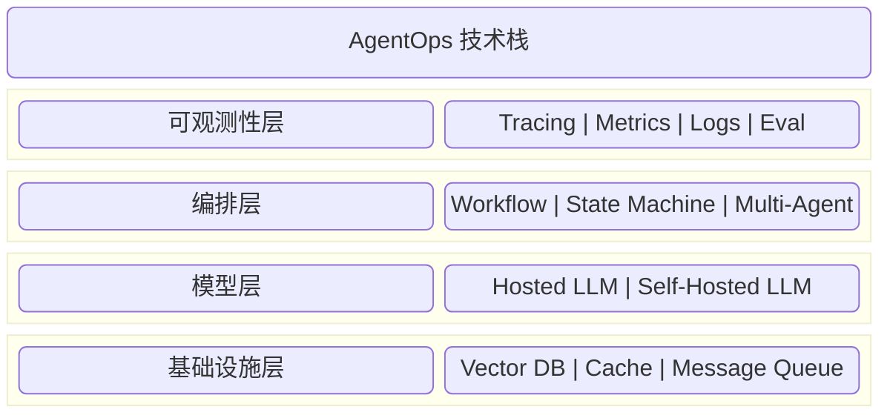

# 第九章 AgentOps 与生产化落地

写好智能体的提示词只是万里长征第一步。将智能体作为一个软件系统发布到生产环境，面临着并发、延迟、成本、错误处理等一系列工程挑战。

本章是写给软件架构师和 SRE 工程师的，探讨如何构建 **健壮**、**可观测**、**可扩展** 的智能体系统。这一类面向生产化落地的工程方法，常被统称为 **AgentOps**。

## 章节导读

- **[9.1 设计模式：从 Workflow 到 Agent](9.1_design_patterns.md)**：总结和对比常见的架构模式。什么时候该用简单的单体智能体？什么时候该用复杂的编排者-工作者模式？从 ReAct 到 Planner-Executor 的演进。

- **[9.2 可观测性：追踪、监控与调试](9.2_observability.md)**
  - 智能体是概率性的，容易出错。如何实现全链路追踪？如何基于 OTel、离线评估与在线评估建立调试闭环？

- **[9.3 性能优化与成本控制](9.3_optimization.md)**
  - 词元成本控制（提示词缓存、语义缓存、计划缓存）、延迟优化（分离式架构、投机解码）以及如何平衡质量与成本。

- **[9.4 企业级智能体平台：架构、安全与治理](9.4_enterprise.md)**
  - 探讨生产环境的安全需求：多层防御（含底层结构化输出约束）、API 密钥管理、数据脱敏、审计日志、容器化部署以及如何满足常见合规要求。

- **[9.5 故障模式与韧性设计](9.5_failures.md)**
  - 聚焦运行时故障的诊断与恢复：死循环、上下文漂移、幻觉执行、级联故障，以及预算、熔断、回放与复盘机制。

- **[9.6 架构陷阱与反模式](9.6_pitfalls_antipatterns.md)**
  - 聚焦设计阶段的错误决策：万能 Agent、长上下文滥用、过早多智能体化、没有评估即上线、未设安全边界等。

- **[9.7 从实验到生产：决策路线图与检查清单](9.7_experiment_to_production.md)**
  - 从 PoC 到生产的完整路线图，包含评估门禁、安全护栏、合规检查与上线前清单。

- **[本章小结](summary.md)**

## 核心概念预览

图 9-0：AgentOps 技术栈概览

下一章将探讨智能体编程实践，介绍主流工具与开发工作流。

---

**下一节**: [9.1 设计模式：从 Workflow 到 Agent](9.1_design_patterns.md)
